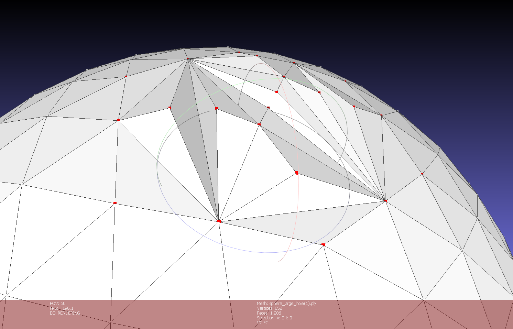
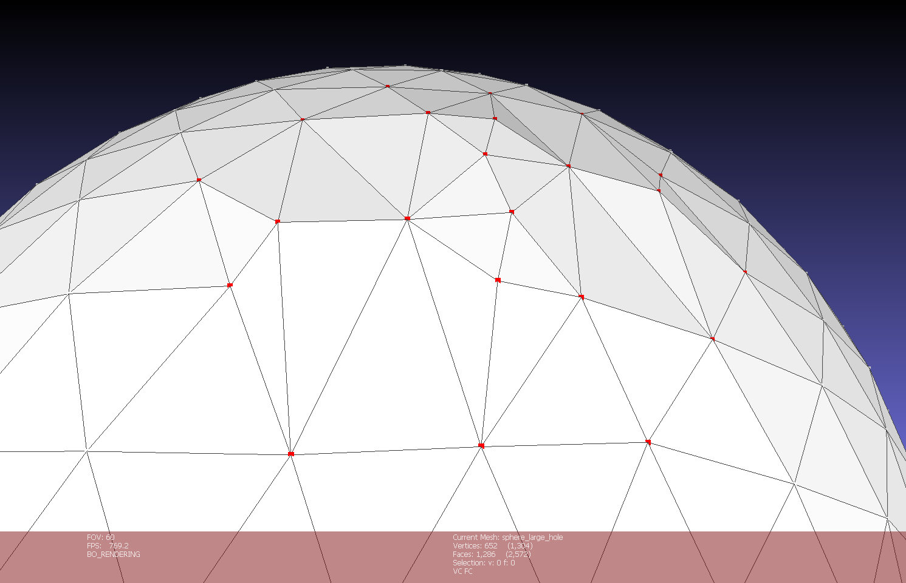

<!-- _class: lead -->
<!-- _paginate: false -->

# Normal Field Diffusion-Guided Hole Filling on 3D Meshes

**Truong Tri Dung — MITIU25208**

Advanced Computer Graphics (IT516)
International University — VNU-HCM

---

## 1. The Problem

**Hole filling** is a core step in 3D mesh processing pipelines.

Holes arise from:
- **Occlusion** during 3D scanning
- **Sensor noise** and dropouts
- **Reflective** or transparent surfaces

**Existing methods** — Liepa 2003, advancing front, volumetric diffusion — tend to produce:
- **Flat patches** that ignore surrounding curvature
- **Over-smoothed surfaces** that wash out detail
- Patches that **don't conform** to the local shape

> We need a filling method that respects the geometry around the hole.

---

## 2. Our Idea: Normal Field Diffusion

**Key insight:** propagate *normal vectors* from the boundary into the hole — not just positions.

Traditional pipeline | NFD pipeline
--- | ---
fit position + smooth | diffuse normals → displace positions
relies on Laplacian of vertices | uses local differential geometry
flat patches on curved objects | curvature-consistent patches

The diffused **normal field** guides how each interior vertex should move to reconstruct a geometrically consistent surface.

**Leverages differential geometry** (normals + curvature) rather than pure positional smoothing.

---

## 3. Six-Step Pipeline

```
Input mesh with hole(s)
       |
 [1] Hole Detection         -- trace boundary edge loops
 [2] Initial Triangulation  -- ear clipping + centroid subdivision
 [3] Boundary Analysis      -- normals + mean curvature at boundary
 [4] Normal Field Diffusion -- heat equation on the patch  (CORE)
 [5] Displacement           -- move interior along diffused normals
 [6] Smoothing              -- Laplacian + Taubin cleanup
       |
Output: filled mesh
```

The key novelty is **Step 4** — the rest is support scaffolding around it.

---

## 4. Boundary Analysis (Step 3)

At every boundary vertex we compute:

**Vertex normal** (area-weighted):
$$n_v = \frac{\sum_{f \in \mathcal{N}(v)} A_f \, n_f}{\left\| \sum_{f \in \mathcal{N}(v)} A_f \, n_f \right\|}$$

**Mean curvature** via the cotangent Laplacian:
$$H(v) = \frac{\|L_{\cot}(v)\|}{2}, \quad w_{ij} = \cot\alpha_{ij} + \cot\beta_{ij}$$

These two quantities tell us **which direction** the surface is heading at the hole boundary and **how fast** it is bending.

They become the **Dirichlet boundary conditions** for the diffusion step.

---

## 5. Normal Field Diffusion — the Core

We treat the patch as a small mesh and solve the **heat equation**
$$\frac{\partial n}{\partial t} = \lambda \, \Delta n$$
with boundary normals held **fixed** (Dirichlet).

**Implicit Euler** + cotangent Laplacian gives the linear system
$$\bigl(I + \lambda\, L_{\cot}\bigr) \, n^{t+1} = n^{t} + \lambda \sum_{j \in \partial \Omega} w_{ij} \, n_{j}$$

- Assembled once as a sparse SPD matrix → **Eigen `SimplicialLDLT`**
- Iterated for `DiffusionIterations` steps
- Result: a smooth normal field that **blends** boundary normals across the patch

---

## 6. Curvature-Guided Displacement (Step 5)

Once every interior vertex has a normal, we move it:
$$v' = v + d(v) \cdot n_{\text{diffused}}(v)$$

**Spherical-cap profile** — treat the hole as a small circle on a sphere:
$$d(v) = \text{scale} \cdot \sqrt{2t - t^2}, \quad \text{scale} = r \cdot \tan(\theta/2)$$

where
- $t \in [0,1]$: normalised **geodesic** distance to the boundary (Dijkstra)
- $r$: mean boundary radius from centroid
- $\theta$: spread of boundary normals around the average

**Effect:** patch smoothly domes out from the boundary and peaks at the centre — exactly a spherical cap that matches the surrounding curvature.

---

## 7. Delaunay Edge Flipping

- Ear clipping + centroid subdivision leave **sliver triangles**.
- **Max-min-angle flip:** swap the shared diagonal whenever it increases the minimum interior angle of the two triangles.
- Matters for NFD because $\cot\alpha + \cot\beta$ blows up on slivers → ill-conditioned Laplacian.

 

<div class="small" style="text-align:center;">

**Left:** `UseDelaunayFlipping = false` &nbsp;|&nbsp; **Right:** `UseDelaunayFlipping = true`

</div>

---

## 8. Post-Processing (Step 6)

Two smoothing passes, both with boundary vertices **fixed**:

1. **Constrained Laplacian** (before displacement)
   Redistributes interior vertices evenly so centroid subdivision doesn't leave slivers.

2. **Taubin $\lambda/\mu$** (after displacement)
   Alternating shrink / inflate — removes per-vertex spikes without shrinking the overall dome.

---

## 9. Implementation

| Component | Details |
|-----------|---------|
| Language  | C++14 |
| Framework | MeshLab filter plugin (Qt 5, VCG Library) |
| Solver    | Eigen 3 sparse + `SimplicialLDLT` |
| Build     | CMake, integrated into MeshLab build tree |
| UI        | `Filters > Remeshing... > NFD Hole Filling` |

**User parameters:**
`MaxHoleSize`, `DiffusionIterations`, `DiffusionLambda`,
`SmoothingIterations`, `RefinementFactor`, `CurvatureStrength`

Pipeline runs end-to-end inside MeshLab — no external tooling needed.

---

## 10. Visual Results

<!-- Insert side-by-side screenshots here:
     - hole mesh vs NFD-filled mesh, same camera
     - one row per model (sphere / torus / bunny / cow)
-->

| Model        | V / F | Holes |
|--------------|------:|------:|
| sphere_small | 642 / 1,274 | 1 |
| sphere_large | 642 / 1,256 | 1 |
| torus        | 640 / 1,274 | 1 |
| bunny        | 34,834 / 69,427 | 6 |
| cow          | 2,903 / 5,774 | 1 |

*Screenshots: `data/input/<name>_hole.ply` → NFD → filled mesh.*

---

## 11. Quantitative Evaluation

Measured with **MeshLab's built-in Hausdorff Distance** filter (both directions) against the unmodified ground truth.

| Model        | Hausdorff | % bbox  | RMS (fwd) % | Notes |
|--------------|----------:|--------:|------------:|-------|
| sphere_small | 4.26e-03  | **0.12 %** | 0.007 %  | baseline |
| sphere_large | 2.06e-02  | **0.59 %** | 0.060 %  | ~5× larger hole |
| torus        | 2.45e-02  | **0.34 %** | 0.001 %  | patch lies on true surface |
| cow          | 3.32e-01  | **2.61 %** | 0.011 %  | reverse-dir dominates |
| bunny        | 8.78e-03  | **3.50 %** | 0.181 %  | 1 peak across 6 holes |

**Forward RMS is below 0.2 % of the bbox diagonal on every model** → patches sit on the true surface, fulfilling the "geometrically consistent" goal of the proposal.

---

## 12. Observations

- **Sphere:** error scales roughly with hole size — expected for a smoothly curved surface.
- **Torus:** patch hugs the true surface (forward RMS 0.001 %); reverse distance is density-limited, tunable via `RefinementFactor`.
- **Bunny:** 3.5 % Hausdorff is a *single-point peak* on the sharpest ear; mean / RMS stay at 0.02 % / 0.18 % — overall quality is high.
- **Cow:** reverse direction dominates → patch is slightly smaller than the removed region; resolvable by increasing `CurvatureStrength` or reducing `RefinementFactor`.

**Two bugs found and fixed during testing:**
- Winding flips on curved meshes (Delaunay edge-flip used an unreliable `avgNormal`).
- New patch triangles rendered as default white instead of inheriting boundary colour.

---

## 13. Conclusion

**What NFD delivers**
- Sub-1 % forward RMS on every tested model
- Curvature-consistent patches rather than flat caps
- Clean integration into MeshLab, usable through the Filters menu

**Beyond the proposal**
- Delaunay edge-flipping (ear-clipping + refinement produce slivers otherwise)
- Spherical-cap displacement profile (analytically matches a hole on a sphere)
- Taubin $\lambda/\mu$ smoothing (spike removal without volume loss)

**Future work**
- Per-vertex scale from local mean curvature (not just a global dome height)
- Sharp-feature preservation for CAD-like inputs
- GPU Laplacian for very large meshes (millions of holes / faces)

---

<!-- _class: lead -->

# Thank you

**Q & A**

<br>

<span class="small">
Source: <code>NFD-HoleFill/plugin/filter_nfd_holefill.cpp</code><br>
Build/run: <code>NFD-HoleFill/BUILD_AND_RUN.md</code><br>
Full results: <code>NFD-HoleFill/evaluation_results.md</code>
</span>
